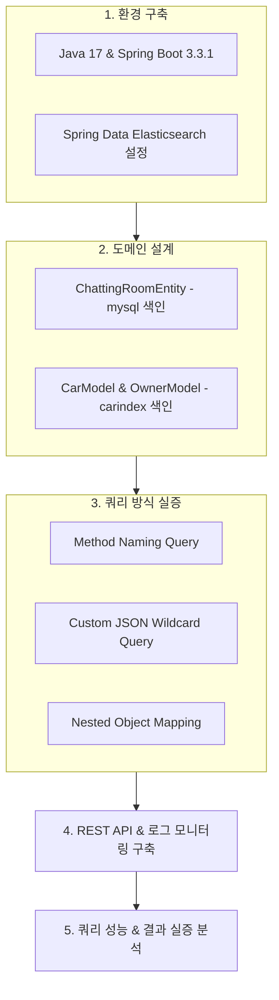

# 🔍 Spring Data Elasticsearch 연동 및 검색 메커니즘 검증 연구 (ElasticsearchTest)

> **프로젝트 개요**: Spring Boot 3.3 및 Spring Data Elasticsearch 환경에서 RDBMS 검색의 한계를 극복하기 위해, Elasticsearch 연동, 다양한 쿼리 전략(Method Name Query vs Wildcard Custom Query)의 동작 원리, 그리고 계층형 도메인(Nested Object) 매핑 구조를 연구 및 검증한 실증 프로젝트입니다.

---

## 📌 1. 연구 배경 및 목적 (Background & Motivation)

### 1.1 배경 (Background)
- **기존 RDBMS (MySQL 등) 검색의 한계**:
  - 관계형 데이터베이스에서 와일드카드 검색(`LIKE '%keyword%'`)은 인덱스 B-Tree 구조를 활용할 수 없어 **전체 테이블 스캔(Full Table Scan)**을 유발합니다.
  - 서비스 규모 확장 및 데이터량 증가에 따라 쿼리 응답 시간 지연과 데이터베이스 CPU Load 폭증이라는 구조적 병목이 발생합니다.
- **Elasticsearch 도입의 필요성**:
  - 역색인(Inverted Index) 구조를 기반으로 하는 분산 검색 엔진 Elasticsearch를 도입하여 대용량 텍스트 데이터의 실시간 고속 검색 및 유연한 쿼리 처리를 도모하고자 했습니다.

### 1.2 연구 목적 (Objectives)
1. **Spring Data Elasticsearch 통합 표준 수립**: Java 17 및 Spring Boot 3.3 환경에서 `Spring Data Elasticsearch`를 안정적으로 통합하고 기본 동작 검증.
2. **검색 쿼리 메커니즘 분석 및 비교**:
   - Spring Data ES가 제공하는 메서드 명명 기반 쿼리(`findAllByName`, `findByName`)와 커스텀 JSON `@Query` 기반 Wildcard Query(`*?0*`) 간의 동작 방식 및 검색 결과 비교.
3. **복합 계층 데이터(Nested Documents) 매핑 및 격리성 검증**:
   - 차량(`CarModel`)과 소유자(`OwnerModel`) 형태의 1:N 연관 데이터 색인 시, 일반 객체 매핑(Plain Object)의 평탄화(Flattening) 문제와 `FieldType.Nested` 적용을 통한 서브 문서 데이터 독립성 검증.

---

## 🏗️ 2. 프로젝트 구조 (Project Structure)

```
ElasticsearchTest/
├── src/
│   ├── main/
│   │   ├── java/com/example/elasticsearch/
│   │   │   ├── controller/
│   │   │   │   ├── CarController.java          # 차량 CRUD 및 브랜드 검색 REST API
│   │   │   │   └── ChattingRoomController.java # 채팅방 검색 쿼리 실험 REST API
│   │   │   ├── document/
│   │   │   │   ├── CarModel.java               # 'carindex' 색인 엔티티 (Nested Owner 포함)
│   │   │   │   ├── OwnerModel.java             # Nested 차주 데이터 객체
│   │   │   │   └── ChattingRoomEntity.java     # 'mysql' 색인 엔티티 (채팅방 데이터)
│   │   │   ├── repository/
│   │   │   │   ├── CarRepository.java          # Car ElasticsearchRepository
│   │   │   │   └── ChattingRoomRepository.java # Custom Query 적용 ChattingRoom Repository
│   │   │   ├── service/
│   │   │   │   └── ChattingRoomService.java    # 채팅방 검색 비즈니스 로직
│   │   │   └── ElasticsearchApplication.java   # Spring Boot 메인 애플리케이션
│   │   └── resources/
│   │       └── application.properties          # Spring 환경 설정
│   └── test/
│       └── java/com/example/elasticsearch/
│           └── ElasticsearchApplicationTests.java # Context Load 테스트
├── build.gradle                                 # 의존성 설정 (Spring Boot 3.3.1, Spring Data ES)
└── README.md                                    # 프로젝트 기술 및 연구 문서
```

---

## 🔬 3. 주요 연구 및 실험 내용 (Experiments & Design)

### 🧪 실험 1: 쿼리 표현 방식별 검색 매커니즘 실증 (`ChattingRoomRepository`)

#### 1) 실험 설계
채팅방 이름(`name`) 탐색 시 3가지 대표적인 쿼리 작성 방식을 적용하여 검색 결과를 관찰하고 비교 분석하였습니다.

```java
public interface ChattingRoomRepository extends ElasticsearchRepository<ChattingRoomEntity, String> {
    // 1. Spring Data Elasticsearch 기본 파생 메서드
    List<ChattingRoomEntity> findAllByName(String name);
    List<ChattingRoomEntity> findByName(String name);

    // 2. Custom JSON Wildcard Query
    @Query("{\"bool\": { \"must\": [ {\"wildcard\": {\"name\": \"*?0*\"}}]}}")
    List<ChattingRoomEntity> findByFromName(String name);
}
```

#### 2) 엔드포인트 구성
- `GET /search/name?name={name}` ➔ `findAllByName()` 호출
- `GET /search/likename?name={name}` ➔ `findByName()` 호출
- `GET /search/test/name?name={name}` ➔ `@Query` 와일드카드(`findByFromName()`) 호출

---

### 🧪 실험 2: 복합 계층 데이터(Nested Object) 색인 및 격리성 검증

#### 1) 실험 설계
`CarModel` 내부에 `List<OwnerModel>` 구조를 포함하도록 도메인을 구성하고, `@Field(type = FieldType.Nested)`를 명시하여 객체 배열의 매핑 동작을 분석했습니다.

```java
@Data
@Document(indexName = "carindex")
public class CarModel {
    private String id;

    @Field(type = FieldType.Text, name = "model")
    private String model;

    @Field(type = FieldType.Integer, name = "year")
    private Integer yearOfManufacture;

    @Field(type = FieldType.Text, name = "brand")
    private String brand;

    @Field(type = FieldType.Nested, name = "owners")
    private List<OwnerModel> owners;
}
```

---

## 📊 4. 연구 결과 및 원인 분석 (Results & Deep Dive)

### 4.1 쿼리 검색 방식별 결과 비교

| 구분 | 쿼리 작성 방식 | 검색 결과 특성 | 원인 분석 (Root Cause) |
| :--- | :--- | :--- | :--- |
| **Method Naming** | `findAllByName`, `findByName` | 토큰(Token) 완전 일치 시에만 결과 반환 | ES 기본 Standard Analyzer는 문장을 단어 단위 토큰으로 쪼개어 역색인을 생성함. 따라서 단어 일부만 입력 시 Match가 되지 않음. |
| **Custom `@Query`** | `@Query` + `wildcard (*?0*)` | 문자열 포함(Sub-string) 여부에 따른 정상 조회 성공 | 인덱스의 역색인 토큰화와 무관하게 raw text 상에서 와일드카드 패턴 매칭을 수행함. |

> ⚠️ **Wildcard Query의 한계 및 성능 고려사항**:
> Custom Wildcard Query(`*keyword*`)는 원하는 부분 검색 결과를 쉽게 얻을 수 있으나, **역색인(Inverted Index) 딕셔너리 탐색의 이점을 포기하고 전체 Term을 스캔**하게 됩니다. 데이터량이 많아지면 CPU 연산 비용과 탐색 시간이 급증하므로, 대규모 데이터셋에서는 **N-gram Analyzer** 또는 **Edge N-gram Analyzer**를 통한 전처리 방식이 요구됩니다.

### 4.2 Nested Object 매핑 결과 분석

- **Plain Object 배열의 문제점**:
  - 일반 객체 배열 형태로 저장하면 ES 내부에서 `{ "owners.name": ["Hong", "Kim"], "owners.age": [30, 20]}` 과 같이 1차원 배열로 평탄화(Flattening) 처리됩니다.
  - 이 경우 "Name=Hong AND Age=20" 조건 검색 시 서로 다른 차주의 정보가 조합되어 조회되는 **Cross-object Matching 오류**가 발생할 수 있습니다.
- **`FieldType.Nested` 적용 결과**:
  - `Nested` 어노테이션 적용 시 ES 내부적으로 각 `OwnerModel`을 **독립된 Hidden Sub-document**로 저장합니다.
  - 이를 통해 차주 각각의 속성(`name`, `age`, `isActive`) 간 독립성을 보장하고 정확한 연관 검색이 가능함을 확인하였습니다.

---

## 🔄 5. 연구 진행 과정 (Research Process)



---

## 💡 6. 결론 및 향후 과제 (Conclusion & Future Work)

### 6.1 결론 (Conclusion)
- **Spring Data ES 통합 패턴 정립**: Repository 추상화 인터페이스를 통한 기본 CRUD 및 커스텀 JSON DSL 쿼리의 유연한 조합 가능성을 입증했습니다.
- **데이터 무결성 확보**: 계층형 1:N 구조의 데이터를 다룰 때 `FieldType.Nested`를 명시하는 것이 데이터 교차 오탐 방지에 필수적임을 확인했습니다.

### 6.2 향후 연구 및 개선 과제 (Future Improvements)
1. **Custom N-gram Analyzer 도입 연구**: Wildcard 검색 성능 저하를 방지하기 위해 Index Settings에 N-gram 탭 및 Analyzer 정의 실험.
2. **CDC (Change Data Capture) 기반 이관 파생 연구**: 실제 RDBMS(MySQL)와 Elasticsearch 간 데이터 실시간 동기화(Logstash / Debezium) 파이프라인 구축.
3. **대용량 데이터 부하 테스트**: 10만 건 이상의 데이터셋 환경에서 쿼리 유형별 응답 속도(Latency) 및 리소스 점유율 측정.

---

## 🛠️ 7. 실행 및 검증 가이드 (How to Run)

### 7.1 사전 조건 (Prerequisites)
- **Java 17** 이상
- **Elasticsearch 8.x** (기본 포트: `localhost:9200`)

### 7.2 애플리케이션 실행
```bash
./gradlew bootRun
```

### 7.3 API 검증 예시 (cURL)

#### 1) 차량 데이터 등록 (`POST /car`)
```bash
curl -X POST http://localhost:8080/car \
  -H "Content-Type: application/json" \
  -d '{
    "id": "1",
    "model": "Model 3",
    "year": 2024,
    "brand": "Tesla",
    "owners": [
      {
        "name": "Alex",
        "age": 28,
        "isActive": true
      }
    ]
  }'
```

#### 2) 브랜드별 차량 조회 (`GET /car/find`)
```bash
curl -X GET "http://localhost:8080/car/find?brand=Tesla"
```

#### 3) 채팅방 와일드카드 검색 테스트 (`GET /search/test/name`)
```bash
curl -X GET "http://localhost:8080/search/test/name?name=test"
```
